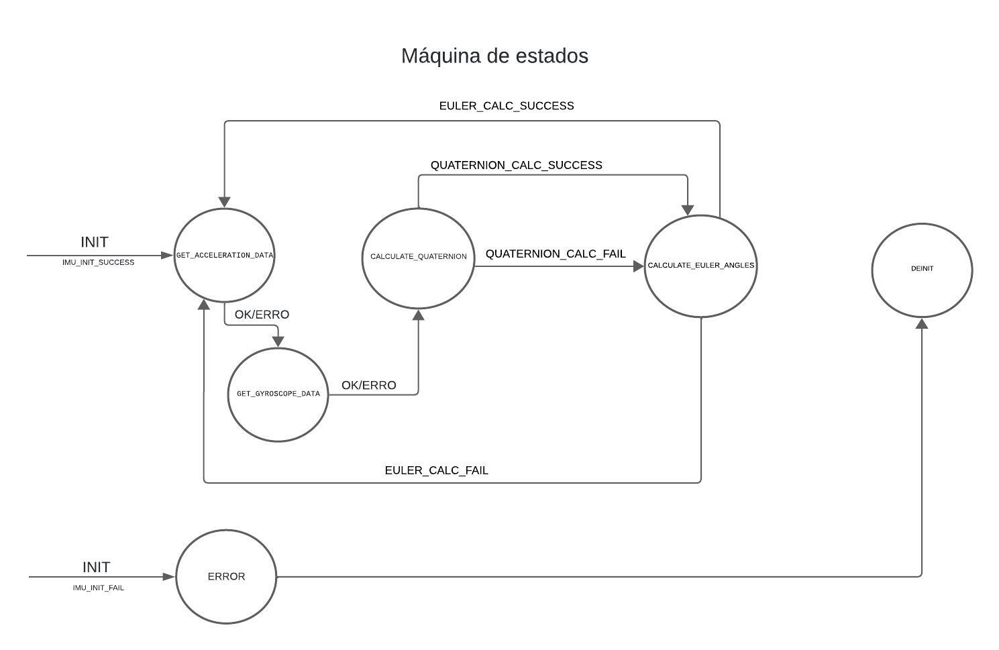

| Supported Targets | ESP32 | ESP32-C2 | ESP32-C3 | ESP32-C6 | ESP32-H2 | ESP32-P4 | ESP32-S2 | ESP32-S3 |
| ----------------- | ----- | -------- | -------- | -------- | -------- | -------- | -------- | -------- |

# Projeto IMU com MPU6050 e ESP-IDF

Este projeto demonstra como interagir com o sensor IMU MPU6050 usando o framework ESP-IDF para o microcontrolador ESP32. O código lida com a comunicação I2C para ler dados do acelerômetro e giroscópio, calcula quaternions e ângulos de Euler, e exibe os resultados.


## Índice

- [Visão Geral](#visão-geral)
- [Requisitos de Hardware](#requisitos-de-hardware)
- [Configuração e Instalação](#configuração-e-instalação)
- [Uso](#uso)
- [Descrição do Código](#descrição-do-código)
- [Exemplo de Saída](#exemplo-de-saída)
- [Especificações do Sistema](#especificações-do-sistema)

## Visão Geral

Este projeto fornece uma implementação básica para a leitura e processamento de dados do sensor MPU6050 usando o ESP32. Ele cobre:

- Leitura de dados de aceleração e giroscópio via I2C.
- Cálculo de quaternions a partir dos dados do sensor.
- Conversão dos quaternions em ângulos de Euler (roll, pitch, yaw).

## Requisitos de Hardware

- **Microcontrolador ESP32**
- **Sensor IMU MPU6050**
- **Fios de conexão**

## Configuração e Instalação

1. **Clone o Repositório**

   ```bash
   git clone <[url-do-repositorio](https://github.com/GabrielAlbinoo/embarcados.git)>
   cd <diretorio-do-repositorio>
   ```
   
## 2. Configurar o Ambiente ESP-IDF

Certifique-se de que o ambiente ESP-IDF esteja configurado corretamente. Siga os passos abaixo para configurar o ESP-IDF:

- **Instalar o ESP-IDF**

  Siga as instruções detalhadas para instalar o ESP-IDF na [documentação oficial do ESP-IDF](https://docs.espressif.com/projects/esp-idf/en/latest/esp32/get-started/).

- **Configurar Variáveis de Ambiente**
  
  Depois de instalar o ESP-IDF, configure as variáveis de ambiente necessárias. Execute o seguinte comando no terminal:

  ```bash
  . $HOME/esp/esp-idf/export.sh
  ```
Ajuste o caminho conforme o local de instalação do ESP-IDF, se necessário.
- **Instalar Dependências**

Instale todas as dependências necessárias para o ESP-IDF:

 ```bash
  . pip install -r $HOME/esp/esp-idf/requirements.txt
```

- **Verificar a Instalação**

Verifique se o ESP-IDF está corretamente configurado executando:

 ```bash
  . idf.py --version
```

Isso deve retornar a versão do ESP-IDF instalada.

## 3. Configurar o Projeto

- **Definir Configurações do Projeto**

  Abra o arquivo de configuração do projeto `sdkconfig` e verifique se as configurações estão corretas para o seu hardware. O arquivo `sdkconfig` é gerado automaticamente quando você executa o comando `idf.py menuconfig`.

  Para ajustar as configurações, use o menu de configuração interativo:

  ```bash
  idf.py menuconfig ```

- **Definir Pinos I2C**

  No código-fonte, especialmente no arquivo `main.c`, ajuste os pinos SDA e SCL conforme a sua configuração de hardware. Aqui está um exemplo de como você pode configurar os pinos I2C:

  ```c
  #define I2C_MASTER_NUM I2C_NUM_0
  #define I2C_MASTER_SDA_IO GPIO_NUM_21
  #define I2C_MASTER_SCL_IO GPIO_NUM_22```
  
Certifique-se de que os pinos definidos aqui correspondem aos pinos físicos conectados ao seu dispositivo I2C.

## 4. Compilar e Gravar

Após a configuração, compile o projeto e grave-o no ESP32 com os seguintes comandos:

```bash
idf.py build
```
- 'idf.py build': Compila o código-fonte do projeto.
- 'idf.py flash': Grava o firmware compilado no ESP32.

## 5. Monitorar a Saída

Para visualizar a saída do console e depurar o seu código, use o monitor serial:

```bash
idf.py monitor
```
Isso abrirá um terminal que exibirá a saída serial do ESP32. Para sair do monitor, pressione 'Ctrl+]'.

## 8. Solução de Problemas

Se você encontrar problemas durante a configuração, compilação ou execução, verifique o seguinte:

- **Conexões de Hardware**: Verifique se os pinos SDA e SCL estão corretamente conectados e se não há conexões soltas.
- **Configurações de I2C**: Certifique-se de que a configuração de pinos I2C no código corresponde às configurações físicas.
- **Logs de Erro**: Observe os logs de erro no monitor serial para identificar e diagnosticar problemas específicos.

## Uso

Depois de carregar o firmware no ESP32, abra o monitor serial para visualizar a saída. O programa imprimirá os dados do sensor e os cálculos realizados.

## Descrição do Código

### `imu_tools.c`

- **`imu_read_data(IMUData *data)`**: Lê dados de aceleração e giroscópio do sensor MPU6050 e preenche a estrutura `IMUData`.
- **`imu_calculate_quaternion(const IMUData *data, Quaternion *quaternion)`**: Converte dados de aceleração e giroscópio em um quaternion.
- **`imu_calculate_euler_angles(const Quaternion *quaternion, EulerAngle *euler)`**: Converte o quaternion em ângulos de Euler (roll, pitch, yaw).

### `sensor_imu.c`

- **`imu_init(uint8_t devAddr, gpio_num_t sda_pin, gpio_num_t scl_pin)`**: Inicializa a interface I2C e configura a comunicação com o sensor MPU6050.
- **`imu_get_acceleration_data(AccelerationData *data)`**: Recupera dados de aceleração do sensor.
- **`imu_get_gyroscope_data(GyroscopeData *data)`**: Recupera dados do giroscópio do sensor.
- **`imu_deinit()`**: Desinicializa o driver I2C.

### `main.c`

- Inicializa o sensor IMU.
- Lê e processa dados de aceleração e giroscópio.
- Calcula quaternions e ângulos de Euler.
- Imprime dados do sensor e valores calculados no console.

## Conversão de Dados

- **Aceleração**: Convertida para m/s² usando o fator de escala `ACCEL_SCALE` e a gravidade.
- **Giroscópio**: Convertido para radianos/segundo usando o fator de escala `GYRO_SCALE`.

## Exemplo de Saída

```bash
*******************
Aceleração (m/s): x = 0.00, y = 0.00, z = 9.81
Giroscópio (rad): x = 0.00, y = 0.00, z = 0.00
Quaternion: w = 1.00, x = 0.00, y = 0.00, z = 0.00
Ângulos de Euler: Roll = 0.00, Pitch = 0.00, Yaw = 0.00
idf.py flash 
```

## Especificações do Sistema

### Diagrama de Blocos


### Máquina de Estados


### Esquemático do Hardware
